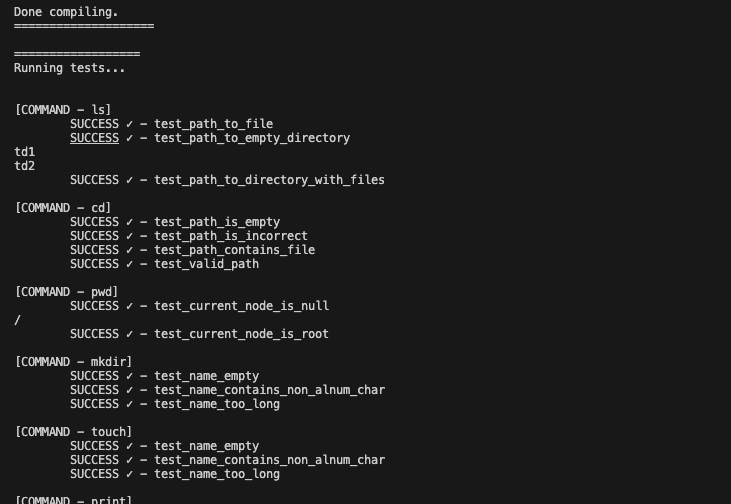
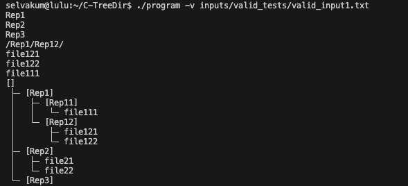
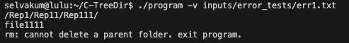

# TREEDIR - C Language Project
This project was made in 5 weeks during the 2nd year of my Bachelor's degree in Computer Science.

## Table of Contents
- [Project Description](#project-description)
- [Gained Experience](#gained-experience)
- [Screenshots](#screenshots)
- [Project Structure](#project-structure)
- [Usage Guide](#usage-guide)
    - [1. For run.sh to Compile](#1-for-runsh-to-compile)
    - [2. For ./program with a Text File](#2-for-program-with-a-text-file)

## Project Description
This project involved creating a C program that simulates a file system's tree structure. It manages folders and files using a tree stored in memory, operating on instructions from an input file. Key commands implemented include `ls`, `cd`, `mkdir`, `touch`, `rm`, `cp`, `mv`, and `print`, each with specific functionalities. **The emphasis is on robust error handling and dynamic memory management. The project offered practical experience in system-level programming in C.**

The project was completed in collaboration with [Yanis](https://github.com/YanisLcn) in approximately 5 weeks.

## Gained Experience
This project marked my initial foray into programming in C. Although it presented some initial challenges, it served as a valuable learning experience, particularly in the realms of memory management, pointer manipulation, and the significance of effective error handling. Furthermore, I acquired proficiency in employing Valgrind for memory leak detection. Given the time constraints, I did find myself working under pressure, but I take pride in the final outcome.

Working in a team of two was a new experience for me, and I found it to be a positive one. We were able to divide the work effectively, and we were able to learn from each other's strengths. I was able to gain a better understanding of the importance of communication and collaboration in a team setting.

## Screenshots
<p align="center">
  
  <br>
  <sub>Running Tests</sub>
</p>

<br>

<p align="center">
  
  <br>
  <sub>Valid Commands</sub>
</p>

<br>

<p align="center">
  
  <br>
  <sub>Invalid Commands</sub>
</p>

## Project Structure
```
.
├── src
│   ├── commands
│   │   ├── cd
│   │   ├── cp
│   │   ├── ls
│   │   ├── mkdir
│   │   ├── mv
│   │   ├── pwd
│   │   ├── rm
│   │   └── touch
│   ├── parser
│   └── utils
├── tests
├── inputs
├── run.sh
└── Makefile
```
_inputs: Contains the text files used for testing (provided by instructors)._

## Usage Guide

### 1. For run.sh to Compile
This `run.sh` script allows you to compile, test, and execute the program.

The options you can use with this script are:

* a: Forces a complete recompilation of the program by executing make clean before make all.
* b: Activates verbose mode. By default, all outputs will be sent to standard output.
* t: Performs tests after compiling the program.
* v: Runs the program with Valgrind to check for memory leaks.
* o: Redirects output to a file. For example, -o output.txt will send the output to the output.txt file.

#### Examples
Here are some examples of how to use this script:

- To completely recompile the program:
    ```bash
    ./run.sh -a
    ```

- To compile the program and perform tests:
    ```bash
    ./run.sh -a -t
    ```
- To compile and run the program with more detailed output:
    ```bash
    ./run.sh -b
    ```

- To compile and run the program with Valgrind:
    ```bash
    ./run.sh -v
    ```

Don't forget to give execution permissions to the script with `chmod +x run.sh` if it's not already executable.

### 2. For ./program with a Text File

Compiling with run.sh produces an executable program that can be used to run the program. It accepts several options, which you can combine as you see fit:

-v: Activates verbose mode.
-t: Executes built-in tests.
-o: Redirects output to a file. For example, -o output.txt will send the output to the output.txt file.

#### Examples
- To run the program with a text file in verbose mode:
    ```bash
    ./program -v <text file>
    ```

- To run the built-in tests in verbose mode:
    ```bash
    ./program -v -t
    ```

- To run the program with a text file and redirect output to a file:
    ```bash
    ./program -o output.txt <text file>
    ```

- To run the built-in tests and redirect output to a file:
    ```bash
    ./program -t -o output.txt
    ```

- To launch Valgrind during the execution of the program with a text file, use the following command:
    ```bash
    valgrind ./program <text file>
    ```
- A more detailed version of Valgrind can be obtained using the following command:
    ```bash
    valgrind --leak-check=full --show-leak-kinds=all --track-origins=yes --verbose ./program <text file>
    ```